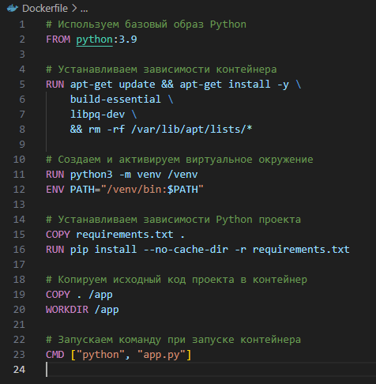

<!DOCTYPE html>
<html lang="en">
  <head>
    
  </head>
  <body>
    <h1>RoadMap</h1>
    
В данном руководстве расписаны основные технологии, которые используются в современном мире разработки. Руководство 

    

      <h2>Оглавление</h2>
      <ul>  
        <li>Docker</li>
          <ul>
            <li>Краткие сведения</li>
            <li>Преимущества и недостатки</li>
              <ul>
                <li>Недостатки</li>
                <li>Преимущества</li>
              </ul>
            <li>Аналоги</li>
            <li>Основные команды</li>
            <li>Dockerfile</li>
              <ul>
                <li>Краткие сведения</li>
                <li>Основные команды</li>
                <li>Пример файла</li>
              </ul>
            <li>docker-compose.yml</li>
              <ul>
                <li>Краткие сведения</li>
                <li>Основные команды</li>
                <li>Основные поля</li>
                <li>Основные технологии для развертывания</li>
                  <ul>
                    <li>Nats</li>
                    <li>PostgreSQL</li>
                    <li>PGAdmin</li>
                    <li>Selery</li>
                    <li>Redis</li>
                    <li>RabbitMQ</li>
                    <li>ElasticSearch</li>
                    <li>Деплой приложения</li>
                  </ul>
              </ul>
            <li>Список источников</li>
          </ul>
        <li>PostgreSQL</li>
          <ul>
            <li>Краткие сведения</li>
            <li>Преимущества и недостатки</li>
            <li>Аналоги</li>
            <li>Основные команды</li>
            <li>SQL-запросы</li>
              <ul>
                <li>TBC</li>
              </ul>
            <li>Взаимодействие с Python</li>
              <ul>
                <li>SQLAlchemy</li>
                  <ul>
                    <li>ORM</li>
                    <li>Mapped, mapped_column()</li>
                    <li>Declarative Base, Metadata</li>
                    <li>Из каких библиотек всё брать</li>
                  </ul>
                <li>psycopg2/asyncpg</li>
                <li>alembic</li>
                  <ul>
                    <li>revision</li>
                  </ul>
              </ul>
          </ul>
        <li>Nats</li>
          <ul>
            <li>Краткие сведения</li>
            <li>Преимущества и недостатки</li>
            <li>Аналоги</li>
            <li>Основные команды</li>
            <li>Взаимодействие с Python</li>
          </ul>
        <li>Selery</li>
          <ul>
            <li>Краткие сведения</li>
            <li>Преимущества и недостатки</li>
            <li>Аналоги</li>
            <li>Основные команды</li>
            <li>Взаимодействие с Python</li>
          </ul>
        <li>Redis</li>
          <ul>
            <li>Краткие сведения</li>
            <li>Преимущества и недостатки</li>
            <li>Аналоги</li>
            <li>Основные команды</li>
            <li>Взаимодействие с Python</li>
          </ul>
        <li>ElasticSearch</li>
          <ul>
            <li>Краткие сведения</li>
            <li>Преимущества и недостатки</li>
            <li>Аналоги</li>
            <li>Основные команды</li>
            <li>Взаимодействие с Python</li>
          </ul>
        <li>Git</li>
          <ul>
            <li>Краткие сведения</li>
            <li>Преимущества и недостатки</li>
          </ul>
        <li>Linux</li>
          <ul>
            <li></li>
          </ul>
        <li>FastAPI</li>
          <ul>
            <li>Краткие сведения</li>
            <li>Преимущества и недостатки</li>
            <li>Аналоги</li>
            <li>Основные команды</li>
            <li>Взаимодействие с Python</li>
          </ul>
        <li>REST API</li>
          <ul>
            <li></li>
          </ul>
        <li>Python</li>
          <ul>
            <li>Краткие сведения</li>
            <li>Преимущества и недостатки</li>
            <li>Виртуальное окружение</li>
              <li>Краткие сведения</li>
              <li>Основные команды</li>
            <li>ООП</li>
              <ul>
                <li>Определение</li>
                <li>Назначение</li>
                <li>Основные концепции</li>
                  <ul>
                    <li>Наследование</li>
                    <li>Полиморфизм</li>
                    <li>Инкапсуляция</li>
                  </ul>
                <li>Дандер методы</li>
              </ul>    
          </ul>
      </ul>
    

    

      <h2>Docker</h2>
      

        <h3>Краткие сведения</h3>
        

          
<b>Docker</b> - программное обеспечение для автоматизации развёртывания и управления приложениями в среде виртуализации на уровне операционной системы; позволяет «упаковать» приложение со всем его окружением и зависимостями в контейнер, а также предоставляет среду по управлению контейнерами.

          
<i>Простым языком</i>: <b>Docker</b> - это инструмент, который позволяет разработчикам, системными администраторам и другим специалистам деплоить их приложения в песочнице (которые называются контейнерами), для запуска на целевой операционной системе, например, <b>Linux</b>.

          
В целом, <b>Docker</b> является мощным инструментом для контейнеризации приложений, но его использование требует понимания его преимуществ и недостатков и правильного подхода к развертыванию и управлению контейнерами.

        

        <h3>Преимущества и недостатки</h3>
        

          <h4>Недостатки</h4>
          
<ul>
            <li class="text">
<b>Производительность</b>
 Docker вносит некоторые накладные расходы на производительность, поскольку включает в себя дополнительный слой виртуализации. В некоторых случаях, особенно если есть необходимость в высоком уровне изоляции, производительность контейнера может быть несколько ниже, чем на хостовой системе.</li>
             
            <li class="text">
<b>Расход ресурсов</b>
 Контейнеры Docker используют ресурсы, такие как память и процессорное время. Если на сервере множество контейнеров, это может привести к увеличенному расходу процессора, памяти и дискового пространства.</li>
             
            <li class="text">
<b>Комплексность</b>
Docker предлагает широкий набор функций и инструментов, что может вызвать некоторую сложность для новичков. Необходимо изучить основные концепции Docker и настроить его правильно, чтобы достичь максимальной эффективности.</li>
             
            <li class="text">
<b>Безопасность</b>
Docker изолирует контейнеры, но все же существует некоторый риск, что недостаточно обеспеченные контейнеры могут быть скомпрометированы. Необходимо принимать меры для обеспечения безопасности контейнеров, такие как ограничение привилегий и настройка прав доступа.</li>
          </ul>

          <h4>Преимущества</h4>
          
<ul>
            <li class="text">
<b>Изолированная среда</b>
Docker контейнеры предоставляют изолированную среду для выполнения приложений. Каждый контейнер содержит все необходимые зависимости, файловую систему и ресурсы, изолируя его от других контейнеров и хостовой операционной системы. Это позволяет избежать конфликтов между зависимостями и упрощает развертывание.</li>
             
            <li class="text">
<b>Портативность</b>
Docker обеспечивает портативность приложений. Поскольку контейнеры содержат все зависимости и настройки, приложение может быть запущено на любом хосте, который поддерживает Docker. Это облегчает развертывание приложений в различных средах, таких как разработка, тестирование и производство.</li>
             
            <li class="text">
<b>Масштабируемост</b>
Docker позволяет легко масштабировать приложения. Вы можете создавать несколько экземпляров контейнера для обработки больших нагрузок или использовать оркестраторы контейнеров, такие как Docker Swarm или Kubernetes, для автоматического масштабирования и управления контейнерами.</li>
             
            <li class="text">
<b>Быстрое развертывание и воспроизводимость</b>
Docker позволяет быстро развернуть и воспроизводить приложения, поскольку контейнеры содержат все необходимое для их работы. Вы можете создать образ контейнера со всеми зависимостями и настройками приложения и легко развернуть его на других системах.</li>
          </ul>

        

        <h3>Аналоги</h3>
        

          
В мире контейнеризации существует несколько популярных аналогов Docker. Вот некоторые из них и их краткое описание

          <ol>
            <li class="text">
<b>Kubernetes</b>
<b>Kubernetes (K8s)</b> - это оркестратор контейнеров с открытым исходным кодом, который позволяет автоматизировать развертывание, масштабирование и управление контейнеризированными приложениями. Kubernetes более широко используется в сравнении с другими альтернативами и предоставляет богатый набор функций для развертывания и управления контейнерами, таких как масштабирование, обнаружение сервисов, управление сетью и обновление без простоев. Однако, <b>Kubernetes</b> сам по себе не является альтернативой для <b>Docker</b>, а скорее может использоваться вместе с <b>Docker</b> для эффективного управления контейнерами.</li>
             
            <li class="text">
<b>rkt (Rocker)</b>
<b>rkt</b> (также известный как <b>Rocker</b>) - это другое альтернативное решение для <b>Docker</b>. Он был разработан командой <b>CoreOS</b> и обеспечивает безопасность, простоту использования и прозрачность. Ключевое отличие rkt заключается в его архитектуре, где каждый контейнер работает в своей изолированной окружении, а взаимодействие между контейнерами осуществляется через передачу файлов (<i>file descriptor passing</i>) и другие декларативные протоколы.</li>
             
            <li class="text">
<b>LXD</b>
<b>LXD</b> (<i>Linux Container Daemon</i>) также предоставляет альтернативу <b>Docker</b>. Он является системой управления контейнерами, которая предназначена для хостов <b>Linux</b>. <b>LXD</b> позволяет запускать системные контейнеры, которые более похожи на виртуальные машины, чем на обычные контейнеры <b>Docker</b>. Он также обеспечивает изоляцию и управление ресурсами, но с использованием более тяжеловесных контейнеров.</li>
             
            <li class="text">
<b>Podman</b>
<b>Подман</b> (<i>Pod Manager</i>) представляет собой средство для управления контейнерами, которое предлагает альтернативу для Docker. Он обеспечивает совместимость с Docker API, что позволяет запускать и управлять контейнерами так же, как и с помощью Docker. Однако, в отличие от Docker, Podman не требует привилегированного доступа и не использует демона, вместо этого он запускает контейнеры в изолированных процессах.</li>
             
            <li class="text">
<b>OpenShift</b>
<b>OpenShift</b> является платформой контейнеризации и разработки приложений, основанной на <b>Kubernetes</b>. В отличие от простой контейнеризации, <b>OpenShift</b> обеспечивает дополнительные функции, такие как автоматизированное масштабирование, мониторинг, управление доступом и деплой приложений в облаке.</li>
          </ol>
        

        <h3>Основные команды</h3>
        

          <ol>
            <li class="text">
<b>docker run</b> - запускает контейнер. Если изображение, из которого создается контейнер, не найдено локально, Docker попытается загрузить его из репозитория.
Пример: docker run -d -p 8080:80 nginx (Запускает контейнер nginx в фоновом режиме, привязывая порт 8080 хоста к порту 80 контейнера.)</li>
            <li class="text">
<b>docker exec</b> - выполняет команду в работающем контейнере.
Пример: docker exec my_container ls (Выполняет команду ls в контейнере с именем my_container.)</li>
            <li class="text">
<b>docker ps</b> - отображает информацию о запущенных контейнерах.
</li>
            <li class="text">
<b>docker build</b> - создает изображение из Dockerfile.
Пример: docker build -t my_image . (Создает изображение с именем my_image из Dockerfile в текущем каталоге.)</li>
            <li class="text">
<b>docker pull</b> - загружает изображение или репозиторий из реестра.
Пример: docker pull nginx (Загружает образ nginx из регистри Docker Hub.)</li>
            <li class="text">
<b>docker push</b> - загружает изображение или репозиторий в реестр.
Пример: docker push my_username/my_image (Загружает изображение my_image в Docker Hub под username my_username.)</li>
            <li class="text">
<b>docker images</b> - Отображает информацию о всех локальных изображениях.
</li>
            <li class="text">
<b>docker login</b> - Регистрирует пользователя или входит в систему в Docker Hub.
</li>
            <li class="text">
<b>docker logout</b> - Выходит из Docker Hub.
</li>
            <li class="text">
<b>docker search</b> - Поиск в Docker Hub.
Пример: docker search nginx (Поиск образов nginx на Docker Hub.)</li>
            <li class="text">
<b>docker version</b> - Отображает информацию о версии Docker.
</li>
            <li class="text">
<b>docker info</b> - Отображает различную информацию о состоянии Docker.
</li>
            <li class="text">
<b>docker build</b> - Используется для создания образа Docker из Dockerfile и .dockerignore файла.
Пример: docker build -t my-app . (Создает образ с именем "my-app" на основе Dockerfile в текущем каталоге)</li>
            <li class="text">
<b>docker-compose</b> - Это отдельная утилита, которая используется для определения и управления многоконтейнерными приложениями Docker. Она позволяет пользователям определять наборы контейнеров в файле YAML, а затем просто запускать эти определения с помощью одной команды.
Пример: docker-compose up (Поднимает все контейнеры, определенные в файле docker-compose.yml в текущем каталоге)</li>
            <li class="text">
<b>docker container</b> - Предназначен для управления контейнерами пользователя.
Пример: docker container ls (Отображает список текущих контейнеров)</li>
            <li class="text">
<b>docker image</b> - Управляет образами Docker.
Пример: docker image ls (Отображает список образов)</li>
            <li class="text">
<b>docker network</b> - Позволяет управлять сетями Docker.
Пример: docker network create my-net (Создает новую сеть с именем "my-net")</li>
            <li class="text">
<b>docker plugin</b> - Позволяет управлять плагинами Docker.
Пример: docker plugin ls (Отображает список установленных плагинов)</li>
            <li class="text">
<b>docker system</b> - Это набор команд для управления информацией о системе Docker, такой как использование дискового пространства и количество запущенных контейнеров.
Пример: docker system df (Показывает использование дискового пространства Docker)</li>
            <li class="text">
<b>docker volume</b> - Управляет томами Docker.
Пример: docker volume create my-vol (Создает новый том с именем "my-vol")</li>
            <li class="text">
<b>docker config</b> - используется для управления конфигурации Docker Swarm.
</li>
            <li class="text">
<b>docker service</b> - это команда управляет сервисами в Docker Swarm. Сервисы это как группы контейнеров, которые работают вместе и предоставляют определенный функционал.
Пример: docker service create --replicas 5 -p 80:80 nginx запустит сервис с 5 копиями Nginx, доступными на порту 80.</li>
            <li class="text">
<b>docker create</b> - создает новый контейнер, но не запускает его.
Пример: docker create --name my_container nginx создаст контейнер с именем my_container на базе образа nginx.</li>
            <li class="text">
<b>docker kill</b> - останавливает один или несколько контейнеров.
Пример: docker kill my_container остановит контейнер с именем my_container.</li>
            <li class="text">
<b>docker diff</b> - отображает изменения файлов и директорий в контейнере.
Пример: docker diff my_container покажет все изменения в контейнере my_container.</li>
            <li class="text">
<b>docker load</b> - загружает образ Docker из tar архива.
Пример: docker load < my_image.tar.</li>
            <li class="text">
<b>docker logs</b> - получает логи с контейнера.
 Пример: docker logs my_container покажет логи контейнера my_container.</li>
            <li class="text">
<b>docker pause</b> - приостанавливает все процессы в одном или нескольких контейнерах.
Пример: docker pause my_container.</li>
            <li class="text">
<b>docker port</b> - показывает порты сопоставленные наружу по отношению к основным портам контейнера.
Пример: docker port my_container покажет это сопоставление для контейнера my_container.</li>
            <li class="text">
<b>docker rename</b> - переименовывает контейнер.
Пример: docker rename my_container new_name переименует my_container в new_name.</li>
            <li class="text">
<b>docker restart</b> - перезапускает контейнер.
Пример: docker restart my_container перезапустит my_container.</li>
            <li class="text">
<b>docker rm</b> - удаляет один или несколько контейнеров.
Пример: docker rm my_container удалит my_container.</li>
            <li class="text">
<b>docker rmi</b> - удаляет один или несколько образов.
Пример: docker rmi nginx удалит образ nginx.</li>
            <li class="text">
<b>docker save</b> - сохраняет образ в tar архив.
Пример: docker save -o my_image.tar nginx сохранит образ nginx в архив my_image.tar.</li>
            <li class="text">
<b>docker start</b> - запускает один или несколько остановленных контейнеров.
Пример: docker start my_container запустит my_container.</li>
            <li class="text">
<b>docker stop</b> - останавливает действующий контейнер.
Пример: docker stop my_container остановит my_container.</li>
            <li class="text">
<b>docker stats</b> - показывает ресурсы (CPU, память и т.д.), используемые контейнером.
Пример: docker stats my_container.</li>
            <li class="text">
<b>docker tag</b> - присваивает тэг образу, это используется для идентификации версий образов.
Пример: docker tag my_image:latest my_image:v1.0.</li>
            <li class="text">
<b>docker top</b> - показывает процессы внутри контейнера.
Пример: docker top my_container.</li>
            <li class="text">
<b>docker unpause</b> - возобновляет все процессы в контейнере. 
Пример: docker unpause my_container.</li>
            <li class="text">
<b>docker update</b> - обновляет конфигурацию контейнера.
Пример: docker update --memory "512m" my_container обновит конфигурацию my_container, установив лимит памяти в 512 мегабайт.</li>
            <li class="text">
<b>docker wait</b> - блокирует выполнение до тех пор, пока контейнер не завершится, а затем печатает exit code.
Пример: docker wait my_container.</li>
          </ol>
          
Это список из 42 основных команд <b>Docker</b>. Для получения расширенной информации о командах можно прочитать официальную документацию.

        

        <h3>Dockerfile</h3>
        

          <h4>Краткие сведения</h4>
          
<b>Dockerfile</b> - это текстовый файл, который содержит набор команд для автоматизации процесса создания Docker-образа. Он используется для описания среды выполнения и конфигурации приложения в контейнере Docker. Dockerfile определяет, какие зависимости и настройки нужно установить, как скопировать исходный код приложения в контейнер, и как запустить приложение.

          <h4>Основные команды</h4>
          
В <b>Dockerfile</b> могут быть использованы следующие основыне команды:

          <ol>
            <li class="text"><b>FROM</b> - указывает базовый образ, на основе которого будет создан новый образ.</li>
            <li class="text"><b>RUN</b> - выполняет команды внутри контейнера во время сборки образа. Например, установка зависимостей, загрузка пакетов и т.д.</li>
            <li class="text"><b>COPY</b> или <b>ADD</b> - копирует файлы или директории из локальной файловой системы в контейнер.</li>
            <li class="text"><b>WORKDIR</b> - устанавливает рабочую директорию для последующих команд.</li>
            <li class="text"><b>CMD</b> или <b>ENTRYPOINT</b> - указывает команду, которая будет выполнена при запуске контейнера.</li>
            <li class="text"><b>EXPOSE</b> - указывает на какой порт (или порты) контейнер должен открывать соединения.</li>
          </ol>
          <h4>Пример файла</h4>
          
          
В этом примере Dockerfile начинается с базового образа Python версии 3.9. Далее устанавливаются необходимые зависимости контейнера, создается и активируется виртуальное окружение, устанавливаются зависимости Python-проекта из файла requirements.txt. Затем копируется исходный код проекта в контейнер, устанавливается рабочая директория и указывается команда для запуска контейнера, в данном случае - запуска файла "app.py".

        

      

    

  </body>
</html>